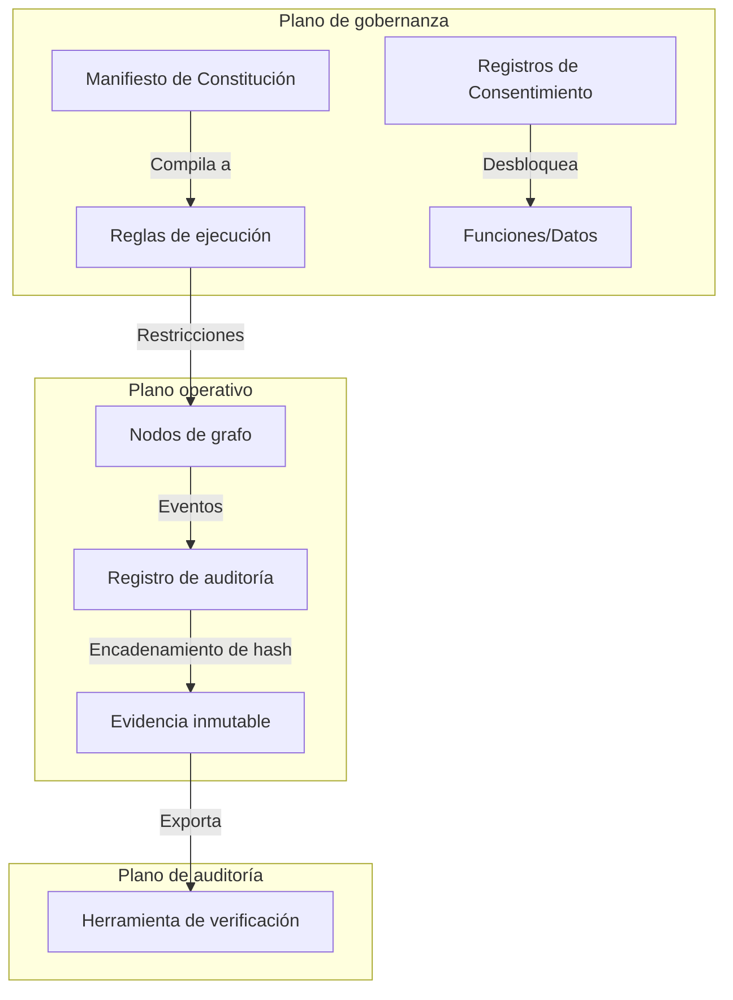
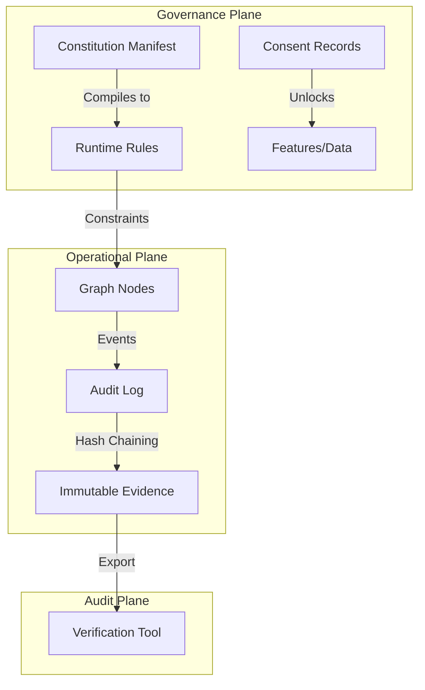

<!--
  IR v1.0 Core Standard
  Copyright (c) 2026 Higher Self Forge Ltd (UK) — Owner/Rights Holder
  Research & field lab: Qori Labs (Peru)

  Licensed under Creative Commons Attribution-NonCommercial-ShareAlike 4.0 International
  https://creativecommons.org/licenses/by-nc-sa/4.0/

  SPDX-License-Identifier: CC-BY-NC-SA-4.0
-->

# IR v1.0 Estándar Núcleo — Infraestructura Soberana e Inteligencia Distribuida

[Versión en Español](#versión-en-español) • [English Version](#english-version) • [Runasimi / Quechua (En proceso)](#hoja-de-ruta-runasimi--quechua-en-proceso)

---

## Versión en Español

[](#)
[](LICENSE)
[](specification/conformance/checklist.md)
[](https://doi.org/10.5281/zenodo.18274616)

**IR v1.0** define un estándar práctico y auditable para desplegar **infraestructura de IA soberana y offline-first** en comunidades con conectividad intermitente—centrado en expectativas de gobernanza de datos indígenas (Principios CARE, prácticas alineadas con OCAP®) y controles de integridad verificables.

Este repositorio es la **referencia autorizada** para implementadores. Contiene:
- **Esquemas JSON normativos** para las estructuras de datos principales
- **Plantillas de gobernanza y consentimiento** adecuadas para despliegues liderados por la comunidad
- **Guías de implementación y auditoría** con requisitos de conformidad

> Licencia: **Creative Commons BY-NC-SA 4.0** (ver [LICENSE](LICENSE)).

**Política de idioma:** Para fines de revisión en el Perú, este documento en español se proporciona como texto de referencia para lectura. La versión normativa del estándar es la inglesa; la versión en español es una traducción informativa. En caso de discrepancia, prevalecerá la versión en inglés.

---

### ¿Qué es IR v1.0?

IR (Inteligencia Recíproca) es un marco abierto para construir y operar **sistemas de IA gobernados por la comunidad** que:
- Funcionan **con prioridad offline** (sincronización store-and-forward, operación local resiliente)
- Proveen **gobernanza verificable** (registros de decisiones, custodia y trazas de auditoría)
- Implementan **controles de soberanía de datos** (consentimiento, límites y reglas exigibles)
- Producen **integridad auditable** (cadenas hash, firmas/pruebas y compilación reproducible de constituciones)

IR v1.0 está diseñado para ser implementable por terceros y seguir siendo **legible para la comunidad**: los artefactos de gobernanza son de primera clase, no un complemento.



### Enlaces rápidos

#### Especificación normativa y conformidad
- Resumen del estándar IR v1.0: [specification/IR-v1.0-Standard-Summary.es-PE.md](specification/IR-v1.0-Standard-Summary.es-PE.md)
- Lista de conformidad: [specification/conformance/checklist.md](specification/conformance/checklist.md)
- Especificación de hashing y canonicalización: [specification/hash-and-canonicalization.es-PE.md](specification/hash-and-canonicalization.es-PE.md)
- Formato mínimo de paquete de evidencia (informativo / no normativo): [specification/evidence-bundle-format.es-PE.md](specification/evidence-bundle-format.es-PE.md)
- Guía de implementación: [guides/guia-implementacion.md](guides/guia-implementacion.md)
- Guía para auditoría: [guides/guia-auditoria.md](guides/guia-auditoria.md)
- Apéndice Perú (informativo / no normativo): [specification/appendix-peru.md](specification/appendix-peru.md)

#### Esquemas principales (JSON Schema draft 2020-12)
- Graph Node: [schemas/graph-node.schema.json](schemas/graph-node.schema.json)
- Constitution Manifest: [schemas/constitution.schema.json](schemas/constitution.schema.json)
- Audit Entry (hash-chain): [schemas/audit-entry.schema.json](schemas/audit-entry.schema.json)
- Consent Record (FPIC): [schemas/consent-record.schema.json](schemas/consent-record.schema.json)
- Boundary Card: [schemas/boundary-card.schema.json](schemas/boundary-card.schema.json)

#### Plantillas de gobernanza y consentimiento
- Carta del Consejo: [templates/governance/Council_Charter_Template.es-PE.md](templates/governance/Council_Charter_Template.es-PE.md)
- Registro de decisiones (CSV): [templates/governance/Decision_Register_Template.csv](templates/governance/Decision_Register_Template.csv)
- Declaración de custodia: [templates/governance/Custodian_Declaration_Template.es-PE.md](templates/governance/Custodian_Declaration_Template.es-PE.md)
- Registro FPIC (plantilla legible): [templates/consent/FPIC_Record_Template.md](templates/consent/FPIC_Record_Template.md)
- Lista de materiales de consentimiento: [templates/consent/Consent_Materials_Checklist.es-PE.md](templates/consent/Consent_Materials_Checklist.es-PE.md)
- Acuerdo de Retorno de Valor (VRA): [templates/vra/VRA_Template.es-PE.md](templates/vra/VRA_Template.es-PE.md)

### Niveles de conformidad

IR v1.0 define dos niveles prácticos de conformidad:

#### IR-Conformant (mínimo)
Una implementación es IR-Conformant si:
- Produce artefactos válidos que cumplen los esquemas requeridos (audit entries, consent records, constituciones, boundary cards, graph nodes)
- Implementa una base mínima de gobernanza (council charter + decision register + custodios nombrados)
- Mantiene un registro de auditoría verificable (entradas encadenadas por hash) y soporta exportación de evidencia para revisión

#### IR-Conformant+ (extendido)
Una implementación es IR-Conformant+ si además:
- Implementa pruebas/firmas criptográficas para compilación de constituciones y eventos críticos de auditoría
- Provee reportes automáticos de conformidad (evidencia checklist legible por máquina)
- Aplica boundary cards y triggers de consentimiento en controles operativos con hooks testeables
- Soporta documentación multi-locale y reportes de transparencia accesibles para la comunidad

Ver la lista: [specification/conformance/checklist.md](specification/conformance/checklist.md).

### Glosario (informativo)

- **Dossier:** expediente/paquete de evidencia que respalda auditoría y revisión comunitaria.
- **LVA:** prefijo de requisitos y expedientes para la línea base de consentimiento (categoría `LVA-*` en la lista de conformidad).
- **FPIC:** Consentimiento Libre, Previo e Informado.
- **VRA:** Acuerdo de Retorno de Valor.
- **CARE:** principios CARE para gobernanza de datos indígenas.
- **OCAP®:** principios de propiedad, control, acceso y posesión de datos indígenas.

### Hoja de ruta: Runasimi / Quechua (en proceso)

Estamos desarrollando una versión oficial en Runasimi (Quechua) para que el estándar sea más accesible y usable en contextos comunitarios. La traducción se acompañará de glosario y decisiones terminológicas para mantener fidelidad técnica y legibilidad cultural.

Plan de trabajo (alto nivel):
- Fase 1 — Glosario y términos clave: definición de equivalencias (gobernanza, consentimiento, límites, auditoría, evidencia, hashes).
- Fase 2 — Plantillas comunitarias primero: FPIC Record, Consent Materials Checklist, Council Charter (prioridad por uso en asamblea).
- Fase 3 — Resumen del estándar: traducción de specification/IR-v1.0-Standard-Summary.md.
- Fase 4 — Guías (implementación/auditoría): traducción parcial con secciones críticas para facilitadores.
- Fase 5 — Revisión y validación comunitaria: iteración con autoridades lingüísticas y revisores locales; publicación por versiones.

Nota: El contenido en Quechua aparecerá en un directorio dedicado (por ejemplo, locales/quz/) cuando esté listo.

### Estructura del repositorio

```text
/
├── schemas/         # Normative JSON Schemas (Validation)
├── templates/       # Governance & Consent Templates (Usage)
├── specification/   # Standard Summary & Conformance Rules
├── guides/          # Implementation & Audit Manuals
└── CHANGELOG.md     # Version History
```

### Notas de licencia

Este estándar se publica bajo CC BY-NC-SA 4.0 (ver LICENSE).
Para consultas de licenciamiento comercial u opciones de doble licenciamiento, por favor contacte a Higher Self Forge Ltd.

**Qué significa NC aquí (orientativo):**
- Permitido: evaluación, despliegues comunitarios sin fines comerciales, uso académico o de investigación.
- No permitido: reventa comercial o prestación de servicios comerciales basados en los artefactos estándar sin licencia comercial.
- Para usos comerciales o doble licenciamiento, solicitar autorización a Higher Self Forge Ltd.

### Cómo citar (académico / institucional)

Si citas este estándar en un paper, política, o documento de procurement:

Higher Self Forge Ltd & Qori Labs. (2026). IR v1.0 Core Standard — Sovereign Infrastructure & Distributed Intelligence (Versión 1.0.0). Repositorio del estándar IR. Licencia CC BY-NC-SA 4.0.

**DOI (Zenodo):** https://doi.org/10.5281/zenodo.18274616

BibTeX sugerido:

```bibtex
@misc{ir_core_standard_v1_2026,
  title        = {IR v1.0 Core Standard — Sovereign Infrastructure & Distributed Intelligence},
  author       = {{Higher Self Forge Ltd} and {Qori Labs}},
  year         = {2026},
  version      = {1.0.0},
  howpublished = {IR Core Standard repository},
  note         = {Licensed under CC BY-NC-SA 4.0}
}
```

### Gobernanza de este repositorio

Este repositorio sigue un flujo de trabajo de estándar público:
- Issues y PRs se usan para proponer cambios.
- Cambios normativos deben actualizar CHANGELOG.md y requisitos de conformidad.
- Cambios en esquemas deben ser compatibles hacia atrás dentro de v1.0, salvo que se versionen explícitamente.

Ver [CONTRIBUTING.md](CONTRIBUTING.md).

### Organización

Titular de derechos (Owner/Rights Holder): Higher Self Forge Ltd (UK). Laboratorio de investigación y campo (Research & field lab): Qori Labs (Peru).

Nota: La traducción oficial al Quechua (Runasimi) se encuentra actualmente en desarrollo en coordinación con autoridades lingüísticas locales.

---

<a id="english-version"></a>

# IR v1.0 Core Standard — Sovereign Infrastructure & Distributed Intelligence

**IR v1.0** defines a practical, auditable standard for deploying sovereign, offline-first AI infrastructure in communities with intermittent connectivity—centering Indigenous data governance expectations (CARE Principles, OCAP®-aligned practices) and verifiable integrity controls.

This repository is the authoritative reference for implementers. It contains:
- Normative JSON Schemas for core data structures
- Governance and consent templates suitable for community-led deployments
- Implementation and audit guides with conformance requirements

> License: Creative Commons BY-NC-SA 4.0 (see [LICENSE](LICENSE)).

**Language policy:** For Peruvian review, the Spanish section is the primary reading reference. The normative version of the standard is English; Spanish is an informative translation. In case of discrepancies, the English text prevails.

## What is IR v1.0?

IR (Inteligencia Recíproca / Reciprocal Intelligence) is an open framework for building and operating community-governed AI systems that:
- Work offline first (store-and-forward sync, resilient local operation)
- Provide verifiable governance (decision records, custodianship, and audit trails)
- Implement data sovereignty controls (consent, boundaries, and enforceable rules)
- Produce auditable integrity (hash-chains, signatures/proofs, and reproducible compilation of constitutions)

IR v1.0 is designed to be implementable by third parties while remaining community-legible: the governance artifacts are first-class, not an afterthought.



## Quick links

### Normative specification & conformance
- IR v1.0 Standard Summary: [specification/IR-v1.0-Standard-Summary.md](specification/IR-v1.0-Standard-Summary.md)
- Conformance checklist: [specification/conformance/checklist.md](specification/conformance/checklist.md)
- Hashing & canonicalization spec: [specification/hash-and-canonicalization.md](specification/hash-and-canonicalization.md)
- Evidence bundle format (informative / non-normative): [specification/evidence-bundle-format.md](specification/evidence-bundle-format.md)
- Implementation guide: [guides/implementation-guide.md](guides/implementation-guide.md)
- Auditor guide: [guides/auditor-guide.md](guides/auditor-guide.md)
- Peru appendix (informative / non-normative): [specification/appendix-peru.md](specification/appendix-peru.md)

### Core schemas (JSON Schema draft 2020-12)
- Graph Node: [schemas/graph-node.schema.json](schemas/graph-node.schema.json)
- Constitution Manifest: [schemas/constitution.schema.json](schemas/constitution.schema.json)
- Audit Entry (hash-chain): [schemas/audit-entry.schema.json](schemas/audit-entry.schema.json)
- Consent Record (FPIC): [schemas/consent-record.schema.json](schemas/consent-record.schema.json)
- Boundary Card: [schemas/boundary-card.schema.json](schemas/boundary-card.schema.json)

### Governance & consent templates
- Council Charter: [templates/governance/Council_Charter_Template.md](templates/governance/Council_Charter_Template.md)
- Decision Register (CSV): [templates/governance/Decision_Register_Template.csv](templates/governance/Decision_Register_Template.csv)
- Custodian Declaration: [templates/governance/Custodian_Declaration_Template.md](templates/governance/Custodian_Declaration_Template.md)
- FPIC Record template: [templates/consent/FPIC_Record_Template.md](templates/consent/FPIC_Record_Template.md)
- Consent Materials Checklist: [templates/consent/Consent_Materials_Checklist.md](templates/consent/Consent_Materials_Checklist.md)
- Value Return Agreement (VRA): [templates/vra/VRA_Template.md](templates/vra/VRA_Template.md)

## Conformance levels

IR v1.0 defines two practical conformance levels:

### IR-Conformant (minimum)
An implementation is IR-Conformant if it:
- Produces valid artifacts matching all required schemas (audit entries, consent records, constitutions, boundary cards, graph nodes)
- Implements a minimum governance baseline (council charter + decision register + named custodians)
- Maintains a verifiable audit log (hash-chained entries) and supports evidence export for review

### IR-Conformant+ (extended)
An implementation is IR-Conformant+ if it additionally:
- Implements cryptographic proofs/signatures for constitution compilation and critical audit events
- Provides automated conformance reporting (machine-readable checklist evidence)
- Enforces boundary cards and consent triggers in runtime controls with testable hooks
- Supports multi-locale documentation and community-accessible transparency reports

See the checklist: [specification/conformance/checklist.md](specification/conformance/checklist.md).

## Glossary (informative)

- **Dossier:** evidence bundle used for audit and community review.
- **LVA:** requirement/dossier prefix for consent baseline items (category `LVA-*` in the conformance checklist).
- **FPIC:** Free, Prior, and Informed Consent.
- **VRA:** Value Return Agreement.
- **CARE:** CARE Principles for Indigenous Data Governance.
- **OCAP®:** principles for ownership, control, access, and possession of Indigenous data.

## Runasimi / Quechua roadmap (in progress)

We are developing an official Runasimi (Quechua) version to make the standard more accessible and usable in community contexts. The translation will be accompanied by a glossary and terminology decisions to preserve technical fidelity and cultural legibility.

Work plan (high level):
- Phase 1 — Glossary & key terms: define equivalents for governance, consent, boundaries, audit, evidence, hashes.
- Phase 2 — Community templates first: FPIC Record, Consent Materials Checklist, Council Charter (priority for assembly use).
- Phase 3 — Standard summary: translate specification/IR-v1.0-Standard-Summary.md.
- Phase 4 — Guides (implementation/audit): partial translation focusing on critical sections for facilitators.
- Phase 5 — Review & community validation: iterate with local linguistic authorities and reviewers; publish by version.

Note: Quechua content will be published in a dedicated directory (e.g., locales/quz/) when ready.

## Repository structure

```text
/
├── schemas/         # Normative JSON Schemas (Validation)
├── templates/       # Governance & Consent Templates (Usage)
├── specification/   # Standard Summary & Conformance Rules
├── guides/          # Implementation & Audit Manuals
└── CHANGELOG.md     # Version History
```

## License notes

This standard is published under CC BY-NC-SA 4.0 (see LICENSE).
For commercial licensing inquiries or dual-licensing options, please contact Higher Self Forge Ltd.

**What NC means here (informative):**
- Allowed: evaluation, community deployments without commercial intent, academic or research use.
- Not allowed: commercial resale or commercial services based on the standard artifacts without a commercial license.
- For commercial or dual-licensing requests, contact Higher Self Forge Ltd.

## Citation (academic / institutional)

If you cite this standard in a paper, policy, or procurement document, use:

Higher Self Forge Ltd & Qori Labs. (2026). IR v1.0 Core Standard — Sovereign Infrastructure & Distributed Intelligence (Version 1.0.0). IR Core Standard repository. Licensed CC BY-NC-SA 4.0.

**DOI (Zenodo):** https://doi.org/10.5281/zenodo.18274616

Suggested BibTeX:

```bibtex
@misc{ir_core_standard_v1_2026,
  title        = {IR v1.0 Core Standard — Sovereign Infrastructure & Distributed Intelligence},
  author       = {{Higher Self Forge Ltd} and {Qori Labs}},
  year         = {2026},
  version      = {1.0.0},
  howpublished = {IR Core Standard repository},
  note         = {Licensed under CC BY-NC-SA 4.0}
}
```

## Governance of this repository

This repository follows a public standards workflow:
- Issues and PRs are used to propose changes.
- Normative changes should update CHANGELOG.md and conformance requirements.
- Schema changes must be backwards-compatible within v1.0 unless explicitly versioned.

See [CONTRIBUTING.md](CONTRIBUTING.md).

## Stewardship

Owner/Rights Holder: Higher Self Forge Ltd (UK). Research & field lab: Qori Labs (Peru).

Note: Official Runasimi (Quechua) translation is currently under development in coordination with local linguistic authorities.
